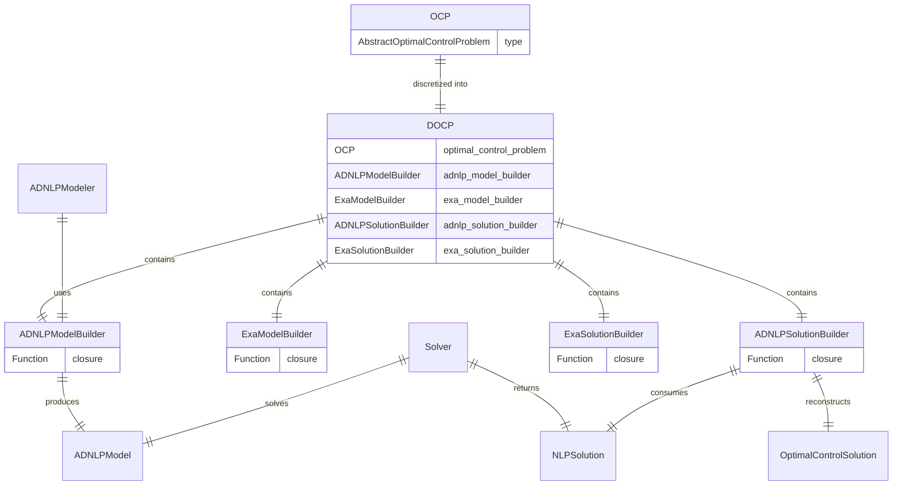
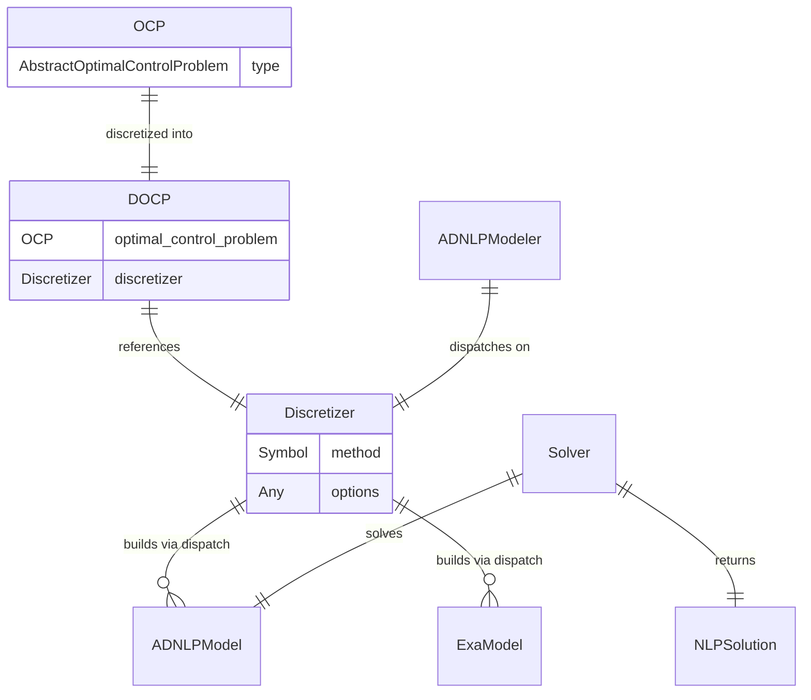
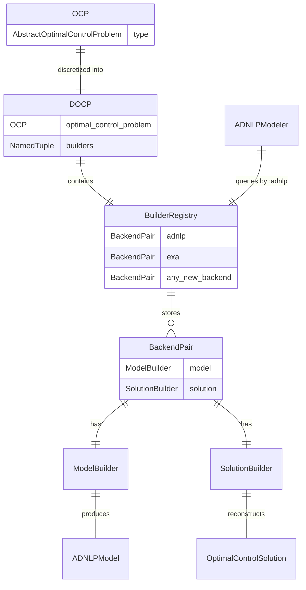
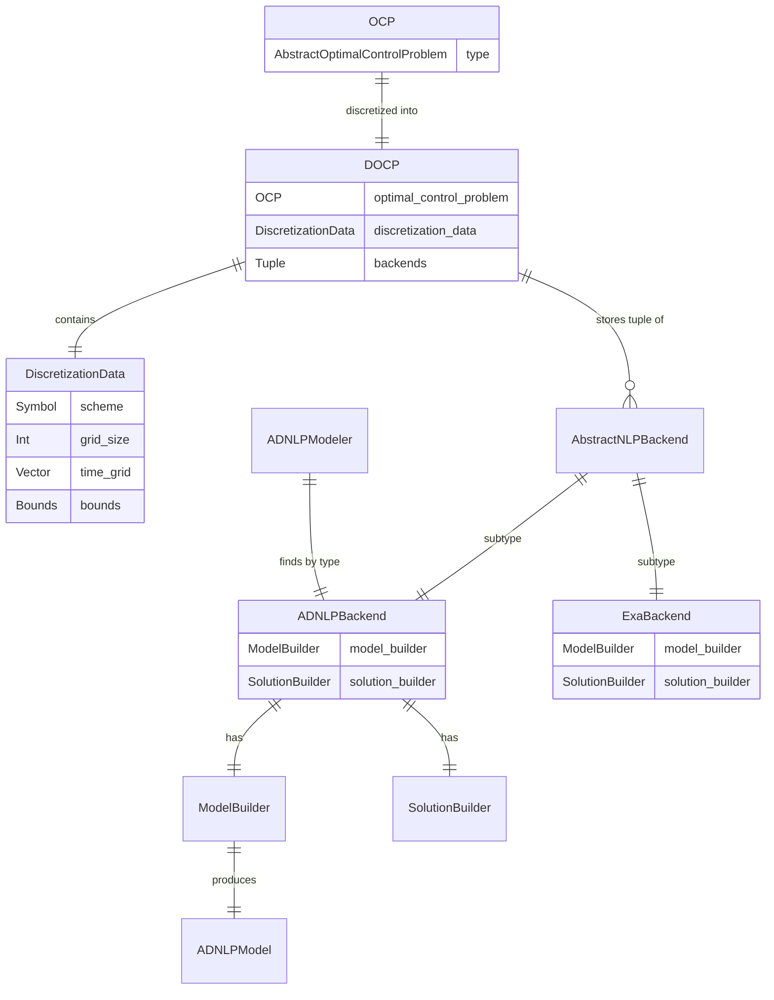
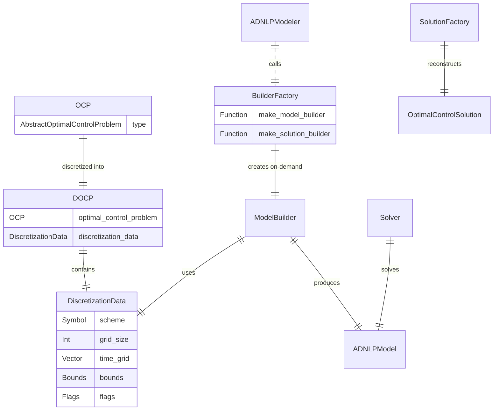
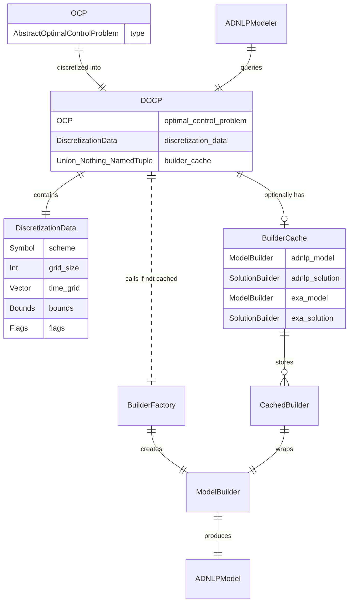
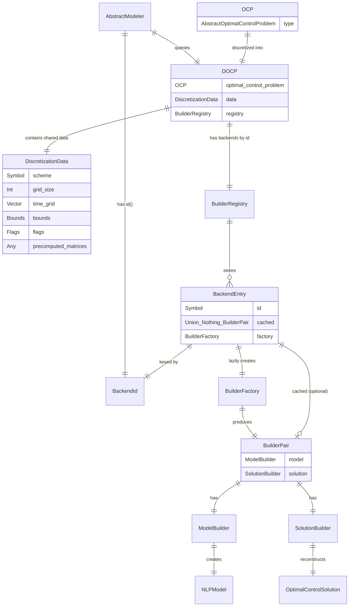

# DOCP Architecture Audit Report

**Date**: 2026-01-27  
**Author**: CTModels Analysis Team  
**Status**: 📊 Deep Analysis  
**Scope**: `DiscretizedOptimalControlProblem` and its integration with CTDirect

---

## Table of Contents

1. [Executive Summary](#executive-summary)
2. [Current Architecture](#current-architecture)
3. [Evaluation against Development Standards](#evaluation-against-development-standards)
4. [Strengths Analysis](#strengths-analysis)
5. [Weaknesses Analysis](#weaknesses-analysis)
6. [Alternative Architectures](#alternative-architectures)
7. [Comparative Evaluation](#comparative-evaluation)
8. [Recommendations](#recommendations)

---

## Executive Summary

This audit analyzes the current DOCP (Discretized Optimal Control Problem) architecture in CTModels and its usage in CTDirect. The architecture implements a **Builder Pattern** where discretization produces a DOCP containing 4 encapsulated builders (ADNLP/Exa model/solution builders).

### Key Findings

| Aspect | Rating | Summary |
|--------|--------|---------|
| **Functional Completeness** | ✅ Good | Pipeline works end-to-end |
| **Separation of Concerns** | ⚠️ Mixed | Discretizer couples tightly to backends |
| **Extensibility** | ❌ Poor | Hard-coded for 2 backends |
| **Type Stability** | ⚠️ Partial | Builders are type-stable, dispatch is dynamic |
| **Complexity for CTDirect** | ⚠️ High | Discretizer must define 4 internal functions |

---

## Current Architecture

### Pipeline Overview

```
OCP                                                           Solution
 │                                                                 ▲
 │ AbstractOptimalControlProblem                                  │
 ▼                                                                 │
Discretizer                                                     Solver
 │                                                                 ▲
 │ AbstractOptimalControlDiscretizer        AbstractOptimizationSolver
 ▼                                                                 │
DOCP ────────────► Modeler ────────────► NLP ─────────────────────┘
      (contains        │                  │
       builders)       │                  │
                       ▼                  ▼
              ADNLPModeler          ADNLPModel
              ExaModeler            ExaModel
```

### Current DOCP Structure & Relationships

This diagram illustrates how the `DOCP` struct acts as a container for backend-specific builders, maintaining the link back to the original `OCP`.



#### Code Detail: `DiscretizedOptimalControlProblem`

```julia
struct DiscretizedOptimalControlProblem{TO, TAMB, TEMB, TASB, TESB} <: AbstractOptimizationProblem
    optimal_control_problem::TO
    adnlp_model_builder::TAMB    # ADNLPModelBuilder
    exa_model_builder::TEMB       # ExaModelBuilder
    adnlp_solution_builder::TASB  # ADNLPSolutionBuilder
    exa_solution_builder::TESB    # ExaSolutionBuilder
end
```

### Builder Pattern

The builders are callable wrappers around closures:

```julia
struct ADNLPModelBuilder{T<:Function} <: AbstractModelBuilder
    f::T  # Closure capturing discretization context
end

function (builder::ADNLPModelBuilder)(initial_guess; kwargs...)
    return builder.f(initial_guess; kwargs...)
end
```

### CTDirect Implementation (Collocation)

In CTDirect, the `Collocation` discretizer defines 4 internal functions that become the builders:

```julia
function (discretizer::Collocation)(ocp::AbstractOptimalControlProblem)
    # Pre-compute discretization data
    discretizer.docp = get_docp()  # Cached in discretizer
    
    # Define 4 builder functions as closures
    function build_adnlp_model(initial_guess; kwargs...)
        docp = discretizer.docp  # Closure captures discretizer
        # ... complex ADNLP construction
    end
    
    function build_adnlp_solution(nlp_solution)
        docp = discretizer.docp
        # ... solution reconstruction
    end
    
    # Similar for Exa builders...
    
    return CTModels.DiscretizedOptimalControlProblem(
        ocp,
        CTModels.ADNLPModelBuilder(build_adnlp_model),
        CTModels.ExaModelBuilder(build_exa_model),
        CTModels.ADNLPSolutionBuilder(build_adnlp_solution),
        CTModels.ExaSolutionBuilder(build_exa_solution),
    )
end
```

### Modeler Flow

```julia
function (modeler::ADNLPModeler)(prob::AbstractOptimizationProblem, initial_guess)
    builder = get_adnlp_model_builder(prob)  # Contract method
    raw_opts = Options.extract_raw_options(Strategies.options(modeler).options)
    return builder(initial_guess; raw_opts...)
end
```

---

## Evaluation against Development Standards

### SOLID Principles Assessment

| Principle | Status | Details |
|-----------|--------|---------|
| **Single Responsibility** | ⚠️ Partial | DOCP mixes data holding with backend selection |
| **Open/Closed** | ❌ Violated | Adding a new backend requires modifying DOCP struct |
| **Liskov Substitution** | ✅ Respected | Builders honor contracts |
| **Interface Segregation** | ⚠️ Partial | Contract has 4 methods, but always returns all 4 |
| **Dependency Inversion** | ✅ Respected | Abstracts via AbstractModelBuilder |

### Type Stability Assessment

| Component | Type Stable? | Notes |
|-----------|--------------|-------|
| `ADNLPModelBuilder` | ✅ Yes | Parametric on function type |
| `ExaModelBuilder` | ✅ Yes | Parametric on function type |
| `get_*_builder` | ✅ Yes | Simple field access |
| Builder invocation | ⚠️ Partial | Return type depends on closure |
| Full pipeline | ⚠️ Partial | Dynamic dispatch at modeler selection |

### Documentation Assessment

| Criterion | Status |
|-----------|--------|
| DocStringExtensions usage | ✅ Complete |
| Examples in docstrings | ✅ Present |
| Error documentation | ✅ Present |
| Cross-references | ⚠️ Could improve |

---

## Strengths Analysis

### 1. **Signature Encapsulation** ✅

The builder pattern successfully hides complex function signatures:

```julia
# Complex internal signature (CTDirect)
function build_adnlp_model(initial_guess; adnlp_backend, show_time, kwargs...)

# Uniform external signature (via builder)
builder(initial_guess; kwargs...)
```

**Benefit**: CTModels doesn't need to know about backend-specific options.

### 2. **Pre-computation Caching** ✅

Discretization data is computed once and captured in closures:

```julia
discretizer.docp = get_docp()  # Computed once
# Closures capture this, reuse it for multiple calls
```

**Benefit**: Efficiency when calling the same builder multiple times with different initial guesses.

### 3. **Type Parametric Builders** ✅

Builders are parametric on the wrapped function:

```julia
struct ADNLPModelBuilder{T<:Function} <: AbstractModelBuilder
```

**Benefit**: Compiler can specialize on specific closure types.

### 4. **Clear Contract Interface** ✅

The `AbstractOptimizationProblem` contract is well-defined:

```julia
get_adnlp_model_builder(prob) -> AbstractModelBuilder
get_exa_model_builder(prob) -> AbstractModelBuilder
get_adnlp_solution_builder(prob) -> AbstractSolutionBuilder
get_exa_solution_builder(prob) -> AbstractSolutionBuilder
```

**Benefit**: Any problem type implementing these methods works with modelers.

### 5. **Decoupled Solve API** ✅

CTSolvers provides a clean, high-level API:

```julia
solution = solve(docp, initial_guess, modeler, solver)
```

**Benefit**: User doesn't need to understand the internal plumbing.

---

## Weaknesses Analysis

### 1. **Hard-coded Backend Proliferation** ❌

The DOCP struct has fixed fields for exactly 2 backends:

```julia
struct DiscretizedOptimalControlProblem{...}
    adnlp_model_builder::TAMB    # ADNLP-specific
    exa_model_builder::TEMB       # Exa-specific
    adnlp_solution_builder::TASB  # ADNLP-specific
    exa_solution_builder::TESB    # Exa-specific
end
```

**Problem**: Adding a third backend (e.g., JuMP, Symbolics-based) requires:
- Modifying the DOCP struct (breaking change)
- Adding 2 new fields (model + solution builder)
- Adding 2 new contract methods
- Updating all discretizers to provide these builders

**Severity**: 🔴 High - Violates Open/Closed principle

### 2. **Discretizer Complexity** ❌

CTDirect's Collocation discretizer must define 4 internal functions:

```julia
function (discretizer::Collocation)(ocp)
    # 1. Define build_adnlp_model
    function build_adnlp_model(initial_guess; kwargs...)
        # ~50 lines
    end
    
    # 2. Define build_adnlp_solution
    function build_adnlp_solution(nlp_solution)
        # ~20 lines
    end
    
    # 3. Define build_exa_model
    function build_exa_model(BaseType, initial_guess; kwargs...)
        # ~60 lines, partially duplicates #1
    end
    
    # 4. Define build_exa_solution  
    function build_exa_solution(nlp_solution)
        # ~20 lines, partially duplicates #2
    end
    
    return DOCP(ocp, builder1, builder2, builder3, builder4)
end
```

**Problem**: 
- Code duplication between ADNLP and Exa versions
- Large, monolithic discretizer method
- Adding a new backend means adding 2 more functions

**Severity**: 🟠 Medium-High

### 3. **Mutable State in Discretizer** ⚠️

The discretizer stores mutable state:

```julia
mutable struct Collocation <: AbstractOptimalControlDiscretizer
    docp::Any       # Mutable cache
    exa_getter::Any # Mutable cache for Exa
end
```

**Problem**:
- Side effects at discretization time
- Closures capture mutable struct
- Thread-safety concerns

**Severity**: 🟠 Medium

### 4. **Model/Solution Builder Coupling** ⚠️

Model builder and solution builder are conceptually paired but stored separately:

```julia
# build_adnlp_model and build_adnlp_solution are coupled
# (solution builder needs context from model building)
# But they're stored as 4 independent fields
```

**Problem**: Easy to mix incompatible builders.

**Comment from project.md**: 
> "NB. it would be better to return builders as model/solution pairs since they are linked"

**Severity**: 🟡 Low-Medium

### 5. **Closure Opacity** ⚠️

Builders wrap opaque closures:

```julia
struct ADNLPModelBuilder{T<:Function}
    f::T  # What does this function need? Unknown from outside.
end
```

**Problem**:
- Hard to introspect what options a builder accepts
- No compile-time checking of option compatibility
- Debugging is harder

**Severity**: 🟡 Low-Medium

### 6. **Redundant Re-computation for Exa** ⚠️

From CTDirect code:

```julia
function build_exa_model(...)
    # "since exa part does not reuse the docp struct"
    scheme = get_scheme(discretizer)  # Recompute
    grid_size, time_grid = grid_options(discretizer)  # Recompute
    # ...
end
```

**Problem**: Exa model building duplicates some computation.

**Severity**: 🟡 Low

---

## Alternative Architectures

### Alternative A: Minimal DOCP with External Dispatch

**Concept**: DOCP stores only OCP + Discretizer. Backend selection happens at modeler level via multiple dispatch.

```julia
# Minimal DOCP
struct DiscretizedOptimalControlProblem <: AbstractOptimizationProblem
    optimal_control_problem::AbstractOptimalControlProblem
    discretizer::AbstractOptimalControlDiscretizer
end

# Backend-specific model building via dispatch
function build_adnlp_model(prob::DiscretizedOptimalControlProblem, initial_guess; kwargs...)
    ocp = prob.optimal_control_problem
    disc = prob.discretizer
    # Use dispatch on discretizer type
    return _build_adnlp_model(ocp, disc, initial_guess; kwargs...)
end

# CTDirect implements:
function _build_adnlp_model(ocp, disc::Collocation, initial_guess; kwargs...)
    # Actual ADNLP construction
end
```

**Advantages**:
- ✅ Minimal DOCP (only 2 fields)
- ✅ Backend extensibility via new methods, not struct changes
- ✅ Clearer responsibility separation
- ✅ Type-stable (dispatch on concrete types)

**Disadvantages**:
- ❌ No pre-computation caching (recompute each time)
- ❌ Requires CTDirect to export many methods
- ⚠️ May need to cache discretization data elsewhere



---

### Alternative B: Registry-based Builder Selection

**Concept**: DOCP stores builders in a Dict/NamedTuple by backend ID.

```julia
# Flexible builder storage
struct DiscretizedOptimalControlProblem{TO, B<:NamedTuple} <: AbstractOptimizationProblem
    optimal_control_problem::TO
    builders::B  # NamedTuple of (model=..., solution=...) by backend
end

# Constructor
function DiscretizedOptimalControlProblem(ocp; builders...)
    return DiscretizedOptimalControlProblem(ocp, NamedTuple(builders))
end

# Usage
docp = DiscretizedOptimalControlProblem(
    ocp,
    adnlp = (model=adnlp_builder, solution=adnlp_sol_builder),
    exa = (model=exa_builder, solution=exa_sol_builder),
    # Easy to add more: jump = (model=..., solution=...)
)

# Generic contract using Modeler ID (Strategies.id)
function get_model_builder(prob::DiscretizedOptimalControlProblem, modeler::AbstractOptimizationModeler)
    backend_id = Strategies.id(typeof(modeler)) # e.g., :adnlp
    return prob.builders[backend_id].model
end
```

**Advantages**:
- ✅ Extensible without struct modification
- ✅ Type-stable via NamedTuple
- ✅ Natural model/solution pairing
- ✅ Maintains pre-computation
- ✅ **Smooth integration**: Automatic builder lookup via `Strategies.id(typeof(modeler))`

**Disadvantages**:
- ⚠️ Slightly more complex contract
- ⚠️ Runtime check if backend exists in the registry
- 🟡 Modeler must define an `id` (already the case for ADNLPModeler)



---

### Alternative C: Strategy Pattern for Backend Selection

**Concept**: DOCP stores a single "backend strategy" that handles both model and solution building.

```julia
# Backend as unified strategy
abstract type AbstractNLPBackend end

struct ADNLPBackend{M, S} <: AbstractNLPBackend
    model_builder::M
    solution_builder::S
end

struct ExaBackend{M, S} <: AbstractNLPBackend
    model_builder::M
    solution_builder::S
end

# DOCP stores OCP + discretization data + backends
struct DiscretizedOptimalControlProblem{TO, D, B<:Tuple} <: AbstractOptimizationProblem
    optimal_control_problem::TO
    discretization_data::D  # Pre-computed, shared
    backends::B  # Tuple of AbstractNLPBackend
end

# Modeler selects backend by type
function (modeler::ADNLPModeler)(prob, initial_guess)
    backend = find_backend(prob.backends, ADNLPBackend)
    return backend.model_builder(prob.discretization_data, initial_guess)
end
```

**Advantages**:
- ✅ Natural pairing of model/solution builders
- ✅ Extensible via new backend types
- ✅ Discretization data shared across backends
- ✅ Type dispatch for backend selection

**Disadvantages**:
- ⚠️ More complex type hierarchy
- ⚠️ CTDirect must produce both backends upfront
- ⚠️ Linear search in backends tuple (minor)



---

### Alternative D: Lazy Builder Construction

**Concept**: DOCP stores only OCP + discretization data. Builders are constructed on-demand.

```julia
# DOCP with discretization data only
struct DiscretizedOptimalControlProblem{TO, DD} <: AbstractOptimizationProblem
    optimal_control_problem::TO
    discretization_data::DD  # All pre-computed stuff
end

# Builder factory (trait-based)
function make_model_builder(::Type{<:ADNLPModeler}, prob::DiscretizedOptimalControlProblem)
    # CTDirect provides extension
    return ADNLPModelBuilder(prob.discretization_data)
end

# Contract returns factory, not stored builder
function (modeler::ADNLPModeler)(prob, initial_guess)
    builder = make_model_builder(ADNLPModeler, prob)  # Factory call
    opts = extract_raw_options(...)
    return builder(initial_guess; opts...)
end
```

**Advantages**:
- ✅ Clean DOCP (only OCP + data)
- ✅ Extensible via method definitions
- ✅ No upfront builder construction for unused backends

**Disadvantages**:
- ❌ Builder constructed each time (if factory is heavy)
- ⚠️ Requires trait/dispatch mechanism
- ⚠️ May need caching layer



---

### Alternative E: Hybrid Approach (Best of Both Worlds)

**Concept**: DOCP stores minimal discretization data + optional cached builders.

```julia
# Core discretization data
struct DiscretizationData{S, G}
    scheme::S
    grid_size::Int
    time_grid::G
    bounds::Bounds
    flags::Flags
end

# DOCP with optional builder cache
struct DiscretizedOptimalControlProblem{TO, DD, BC} <: AbstractOptimizationProblem
    optimal_control_problem::TO
    discretization_data::DD
    builder_cache::BC  # NamedTuple or nothing, lazily populated
end

# Constructor without cache
function DiscretizedOptimalControlProblem(ocp, data)
    return DiscretizedOptimalControlProblem(ocp, data, nothing)
end

# Lazy builder access with caching
function get_adnlp_model_builder(prob::DiscretizedOptimalControlProblem)
    if prob.builder_cache !== nothing && haskey(prob.builder_cache, :adnlp_model)
        return prob.builder_cache.adnlp_model
    end
    # Construct on demand
    return _make_adnlp_builder(prob.optimal_control_problem, prob.discretization_data)
end
```

**Advantages**:
- ✅ Lean DOCP construction
- ✅ Caching when beneficial
- ✅ Extensible (new backends via methods)
- ✅ Discretization data is explicit

**Disadvantages**:
- ⚠️ More complex access pattern
- ⚠️ Mutable cache if used
- ⚠️ Two ways to access (cached vs fresh)



---

## Comparative Evaluation

### Evaluation Matrix

| Criterion | Current | Alt A (Minimal) | Alt B (Registry) | Alt C (Strategy) | Alt D (Lazy) | Alt E (Hybrid) |
|-----------|---------|-----------------|------------------|------------------|--------------|----------------|
| **O/C Principle** | ❌ Poor | ✅ Good | ✅ Good | ✅ Good | ✅ Good | ✅ Good |
| **Type Stability** | ⚠️ OK | ✅ Good | ✅ Good | ✅ Good | ⚠️ OK | ✅ Good |
| **Pre-computation** | ✅ Yes | ❌ No | ✅ Yes | ✅ Yes | ⚠️ Optional | ✅ Yes |
| **CTDirect Simplicity** | ❌ Poor | ✅ Good | ⚠️ Medium | ⚠️ Medium | ✅ Good | ✅ Good |
| **Backend Extensibility** | ❌ Hard | ✅ Easy | ✅ Easy | ✅ Easy | ✅ Easy | ✅ Easy |
| **Breaking Change Risk** | ⭐ Baseline | 🔴 High | 🟡 Medium | 🟡 Medium | 🟡 Medium | 🟡 Medium |
| **Implementation Effort** | ⭐ Baseline | 🟢 Low | 🟡 Medium | 🟠 High | 🟡 Medium | 🟠 High |

### Score Summary (1-5, higher is better)

| Alternative | Total Score | Best For |
|-------------|-------------|----------|
| **Current** | 2.5 | Legacy compatibility |
| **Alt A (Minimal)** | 3.5 | Simplicity, if caching not needed |
| **Alt B (Registry)** | 4.0 | Balance of flexibility and simplicity |
| **Alt C (Strategy)** | 3.5 | Strong typing, complex backends |
| **Alt D (Lazy)** | 3.5 | Memory efficiency |
| **Alt E (Hybrid)** | 4.0 | Maximum flexibility, at higher complexity |

---

## Recommendations

### Short-term Recommendations (Low Effort)

1. **Document the current limitations explicitly** in DOCP docstrings
2. **Add issue/TODO for future refactoring** toward Alternative B or E
3. **Consolidate CTDirect's internal functions** to reduce duplication

### Medium-term Recommendations (Medium Effort)

> [!IMPORTANT]
> **Recommended: Migrate to Alternative B (Registry-based)**

Rationale:
- Best balance of **extensibility** and **implementation simplicity**
- Maintains **pre-computation benefits**
- Natural **model/solution pairing**
- **Type-stable** via NamedTuple
- **Minimal breaking changes** to CTDirect (builders still created the same way)

Migration path:
1. Create `DiscretizedOptimalControlProblemV2` with registry approach
2. Add compatibility layer to support both APIs
3. Deprecate old `DiscretizedOptimalControlProblem`
4. Update CTDirect to use new API
5. Remove deprecated code in next major version

### Long-term Vision: Unified Extensible Architecture

The long-term vision synthesizes the best elements from all proposed alternatives into a coherent, extensible architecture. This "**Alternative F**" represents the ideal target state combining:

| Component | Source | Benefit |
|-----------|--------|---------|
| **DiscretizationData** | Alt C, D, E | Explicit, inspectable data |
| **Builder Registry** | Alt B | Extensibility via NamedTuple |
| **Strategies.id lookup** | Current (`ADNLPModeler`) | Automatic backend selection |
| **Lazy construction** | Alt D | Memory efficiency |
| **Optional caching** | Alt E | Performance for repeated use |

#### Core Architecture



#### Key Design Principles

1. **Separation of Concerns**
   - `DiscretizationData`: Pure data, no closures. Inspectable, serializable.
   - `BuilderFactory`: Logic for constructing builders from data.
   - `BuilderPair`: Paired model + solution builders (cannot mismatch).

2. **Extensibility via Registration**
   - New backends are added by defining:
     1. A `BuilderFactory` method for the backend
     2. A `Strategies.id` for the corresponding modeler
   - No modification to `DOCP` struct is required.

3. **Lazy Construction with Optional Caching**
   - Builders are created on first use (memory-efficient).
   - Cache is optional and populated when `get_builder` is called.
   - Cache can be bypassed for fresh construction.

4. **Type-Safe Lookup via `Strategies.id`**
   - Modeler type automatically selects the correct backend.
   - No Symbol literals in user code.

#### Implementation Sketch

```julia
# ─────────────────────────────────────────────────────────────────────────────
# 1. DiscretizationData: All precomputed values, no closures
# ─────────────────────────────────────────────────────────────────────────────
struct DiscretizationData{S, G, B, F}
    scheme::S
    grid_size::Int
    time_grid::G
    bounds::B
    flags::F
    # Additional precomputed data...
end

# ─────────────────────────────────────────────────────────────────────────────
# 2. BuilderPair: Paired model + solution builders
# ─────────────────────────────────────────────────────────────────────────────
struct BuilderPair{M, S}
    model::M
    solution::S
end

# ─────────────────────────────────────────────────────────────────────────────
# 3. BackendEntry: Lazy factory + optional cache
# ─────────────────────────────────────────────────────────────────────────────
mutable struct BackendEntry{F}
    factory::F                       # (OCP, Data) -> BuilderPair
    cached::Union{Nothing, BuilderPair}
end
BackendEntry(factory) = BackendEntry(factory, nothing)

function get_builders(entry::BackendEntry, ocp, data; use_cache::Bool=true)
    if use_cache && entry.cached !== nothing
        return entry.cached
    end
    pair = entry.factory(ocp, data)
    if use_cache
        entry.cached = pair
    end
    return pair
end

# ─────────────────────────────────────────────────────────────────────────────
# 4. DOCP: Unified structure
# ─────────────────────────────────────────────────────────────────────────────
struct DiscretizedOptimalControlProblem{TO, DD, R<:NamedTuple} <: AbstractOptimizationProblem
    optimal_control_problem::TO
    discretization_data::DD
    registry::R  # NamedTuple{(:adnlp, :exa, ...), <:Tuple{BackendEntry, ...}}
end

# ─────────────────────────────────────────────────────────────────────────────
# 5. Generic API: Uses Strategies.id for automatic lookup
# ─────────────────────────────────────────────────────────────────────────────
function get_model_builder(prob::DiscretizedOptimalControlProblem, modeler::AbstractOptimizationModeler)
    id = Strategies.id(typeof(modeler))
    entry = prob.registry[id]
    pair = get_builders(entry, prob.optimal_control_problem, prob.discretization_data)
    return pair.model
end

function get_solution_builder(prob::DiscretizedOptimalControlProblem, modeler::AbstractOptimizationModeler)
    id = Strategies.id(typeof(modeler))
    entry = prob.registry[id]
    pair = get_builders(entry, prob.optimal_control_problem, prob.discretization_data)
    return pair.solution
end

# ─────────────────────────────────────────────────────────────────────────────
# 6. CTDirect Extension: Register ADNLP backend
# ─────────────────────────────────────────────────────────────────────────────
function adnlp_factory(ocp, data::DiscretizationData)
    model_builder = ADNLPModelBuilder(...) # Uses data, not closures
    solution_builder = ADNLPSolutionBuilder(...)
    return BuilderPair(model_builder, solution_builder)
end

# Usage in discretizer
function (disc::Collocation)(ocp::AbstractOptimalControlProblem)
    data = DiscretizationData(...)  # Precompute once
    registry = (
        adnlp = BackendEntry(adnlp_factory),
        exa = BackendEntry(exa_factory),
    )
    return DiscretizedOptimalControlProblem(ocp, data, registry)
end
```

#### Handling Different Builder Signatures

A key design challenge is that different backends have **different call signatures**:

| Builder | Current Signature | Reason |
|---------|-------------------|--------|
| `ADNLPModelBuilder` | `builder(initial_guess; kwargs...)` | Standard call |
| `ExaModelBuilder` | `builder(BaseType, initial_guess; kwargs...)` | Requires type parameter for GPU/precision |

**Current Implementation**: The modeler knows the builder signature:

```julia
# ADNLPModeler: Simple signature
function (modeler::ADNLPModeler)(prob, initial_guess)
    builder = get_adnlp_model_builder(prob)
    raw_opts = Options.extract_raw_options(opts.options)
    return builder(initial_guess; raw_opts...)  # No BaseType
end

# ExaModeler{BaseType}: Needs to pass BaseType
function (modeler::ExaModeler{BaseType})(prob, initial_guess) where {BaseType}
    builder = get_exa_model_builder(prob)
    raw_opts = Options.extract_raw_options(opts.options)
    return builder(BaseType, initial_guess; raw_opts...)  # BaseType first arg
end
```

**Long-term Solution**: The modeler remains responsible for knowing how to invoke its builder. The key insight is that:

1. **Builders are backend-specific** - their signature is fixed for each backend type
2. **Modelers are the experts** - they know how to call their paired builder
3. **The registry only stores/retrieves** - it doesn't invoke builders directly

Here's the complete modeler implementation for both backends:

```julia
# ─────────────────────────────────────────────────────────────────────────────
# 7. Modeler Implementations: Backend-specific invocation
# ─────────────────────────────────────────────────────────────────────────────

# ─── ADNLPModeler ─────────────────────────────────────────────────────────────
struct ADNLPModeler <: AbstractOptimizationModeler
    options::Strategies.StrategyOptions
end

Strategies.id(::Type{<:ADNLPModeler}) = :adnlp

function (modeler::ADNLPModeler)(
    prob::DiscretizedOptimalControlProblem,
    initial_guess
)::ADNLPModels.ADNLPModel
    opts = Strategies.options(modeler)
    
    # Get builder from registry using modeler's id
    builder = get_model_builder(prob, modeler)  # Uses Strategies.id(:adnlp)
    
    # Extract raw options
    raw_opts = Options.extract_raw_options(opts.options)
    
    # ADNLPModelBuilder signature: (initial_guess; kwargs...)
    return builder(initial_guess; raw_opts...)
end

function (modeler::ADNLPModeler)(
    prob::DiscretizedOptimalControlProblem,
    nlp_solution::SolverCore.AbstractExecutionStats
)
    builder = get_solution_builder(prob, modeler)
    return builder(nlp_solution)
end

# ─── ExaModeler{BaseType} ─────────────────────────────────────────────────────
struct ExaModeler{BaseType<:AbstractFloat} <: AbstractOptimizationModeler
    options::Strategies.StrategyOptions
end

Strategies.id(::Type{<:ExaModeler}) = :exa

function (modeler::ExaModeler{BaseType})(
    prob::DiscretizedOptimalControlProblem,
    initial_guess
)::ExaModels.ExaModel{BaseType} where {BaseType<:AbstractFloat}
    opts = Strategies.options(modeler)
    
    # Get builder from registry using modeler's id
    builder = get_model_builder(prob, modeler)  # Uses Strategies.id(:exa)
    
    # Extract raw options
    raw_opts = Options.extract_raw_options(opts.options)
    
    # ExaModelBuilder signature: (BaseType, initial_guess; kwargs...)
    # The modeler knows it must pass BaseType as first argument
    return builder(BaseType, initial_guess; raw_opts...)
end

function (modeler::ExaModeler{BaseType})(
    prob::DiscretizedOptimalControlProblem,
    nlp_solution::SolverCore.AbstractExecutionStats
) where {BaseType}
    builder = get_solution_builder(prob, modeler)
    return builder(nlp_solution)
end
```

**Key Design Decisions**:

1. **No Unified Builder Interface**: We don't force all builders to have the same signature. This would require awkward workarounds for ExaModeler's `BaseType`.

2. **Modeler Owns Invocation Logic**: Each modeler knows exactly how to call its builder. This is cleaner than trying to abstract away the differences.

3. **Registry is Signature-Agnostic**: The registry just stores and retrieves builders. It doesn't care about their call signatures.

4. **Type Safety via NamedTuple Keys**: The `Strategies.id` mechanism ensures the correct builder is retrieved for each modeler type.

```mermaid
sequenceDiagram
    participant User
    participant ADNLPModeler
    participant ExaModeler
    participant DOCP
    participant Registry
    participant Builder

    User->>ADNLPModeler: modeler(prob, x0)
    ADNLPModeler->>DOCP: get_model_builder(prob, modeler)
    DOCP->>Registry: registry[:adnlp].model
    Registry-->>ADNLPModeler: ADNLPModelBuilder
    ADNLPModeler->>Builder: builder(x0; opts...)
    Builder-->>User: ADNLPModel

    User->>ExaModeler: modeler(prob, x0)
    ExaModeler->>DOCP: get_model_builder(prob, modeler)
    DOCP->>Registry: registry[:exa].model
    Registry-->>ExaModeler: ExaModelBuilder
    ExaModeler->>Builder: builder(Float32, x0; opts...)
    Builder-->>User: ExaModel{Float32}
```

#### Migration Strategy

| Phase | Action | Breaking Change |
|-------|--------|-----------------|
| **Phase 1** | Add `DiscretizationData` type alongside current closures | None |
| **Phase 2** | Implement `BuilderRegistry` with wrapper for old API | None |
| **Phase 3** | Deprecate direct `adnlp_model_builder` field access | Deprecation warning |
| **Phase 4** | CTDirect produces `DiscretizationData` + factories | CTDirect update |
| **Phase 5** | Remove deprecated fields, switch to registry-only | Major version bump |

#### Benefits Summary

| Criterion | Current | Long-term Target |
|-----------|---------|------------------|
| **Extensibility** | ❌ Requires struct change | ✅ Add factory + id only |
| **Type Stability** | ⚠️ OK | ✅ Full via NamedTuple |
| **Inspectability** | ❌ Opaque closures | ✅ Explicit data |
| **Memory Efficiency** | ⚠️ All builders upfront | ✅ Lazy construction |
| **Builder Pairing** | ❌ Independent fields | ✅ BuilderPair enforced |
| **Caching** | ❌ None | ✅ Optional |


---

## Appendix: Code Sketches

### Alternative B Implementation Sketch

```julia
# New DOCP with registry
struct DiscretizedOptimalControlProblemV2{TO, B} <: AbstractOptimizationProblem
    optimal_control_problem::TO
    backends::B  # NamedTuple{(:adnlp, :exa, ...), <:Tuple}
end

# Backend pair type
struct BackendBuilders{M, S}
    model_builder::M
    solution_builder::S
end

# Constructor
function DiscretizedOptimalControlProblemV2(ocp; kwargs...)
    backends = NamedTuple{Tuple(keys(kwargs))}(
        BackendBuilders(v.model, v.solution) for v in values(kwargs)
    )
    return DiscretizedOptimalControlProblemV2(ocp, backends)
end

# Generic accessors
function get_model_builder(prob::DiscretizedOptimalControlProblemV2, backend::Symbol)
    return prob.backends[backend].model_builder
end

function get_solution_builder(prob::DiscretizedOptimalControlProblemV2, backend::Symbol)
    return prob.backends[backend].solution_builder
end

# Modeler uses backend ID
function (modeler::ADNLPModeler)(prob::DiscretizedOptimalControlProblemV2, initial_guess)
    builder = get_model_builder(prob, :adnlp)
    raw_opts = Options.extract_raw_options(Strategies.options(modeler).options)
    return builder(initial_guess; raw_opts...)
end
```

---

**End of Audit Report**
